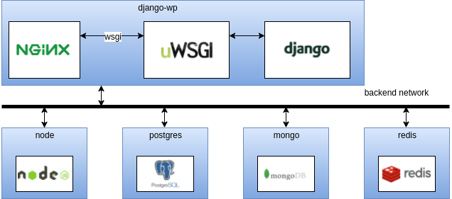

# Django SSR con postgress y mongodb (previo)

Este proyecto consiste en crear una arquitectura que perimta crear aplicaciones web empresariales con las siguientes
caracteristicas:

- Indexable por todos los buscadores: el servidor renderiza todo el JavaScript retornando un documentl html completo.
- Alta interactividad: se utiliza VUE.JS como framework para manejar la vista.
- Alta escalabilidad: se utilizan contenedores docker que se pueden replicar falcilmente.

#Acceso
- Se utiliza un proxy revertido, para acceder al host utilizar la url: django.localhost
- El certificado ssl es autofirmado.

# Arquitectura

# Listado de commandos
Todos los comandos de este projecto estan en un Makefile. Los comandos
disponibles són:

| Commando      	 | Acción                                    		|
|--------------------|--------------------------------------------------|
| make b        	 | construye todos los contenedores 		 		|
| make b-django 	 | construye el contenedor de django  		 		|
| make u        	 | inicia todos los contenedores             		|
| make u-node        |   inicia el contenedor de node            		|
| make d             |   para todos los contenedores             		|
| make s-django      |   abre una consola en el contenedor de django  	|
| make s-node        |   abre una consola en el contenedor de node      |
| make r-django      |   reinicia el contenedor de django               |
| make g-remove-all  |   se eliminan todos los contenedores del sistema |
| make g-stop-all    |   se paran todos los contenedroes del sistema    |

